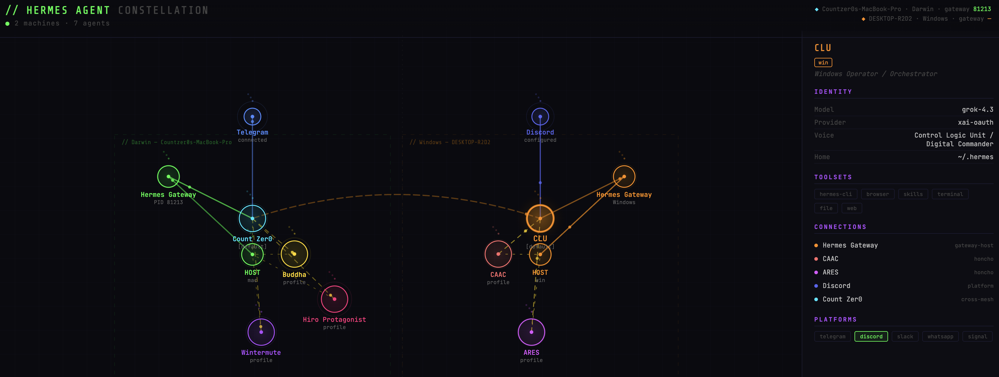

# Hermes Agent Constellation

A dynamic, cyberpunk-styled network visualization of your [Hermes Agent](https://github.com/NousResearch/hermes-agent) ecosystem. Shows all agents across multiple machines, their connections, models, roles, and platform status — auto-updating from live config data.



## Features

- **Multi-machine** — visualize agents across Mac, Windows, Linux
- **Auto-refreshing** — HTML polls `agents.json` every 60 seconds
- **Live data** — collector scripts read real Hermes configs (SOUL.md, config.yaml, honcho.json, gateway_state.json)
- **Interactive** — click any node to see agent details (model, provider, voice, toolsets, connections)
- **Animated** — glowing nodes, pulsing edges, traveling data dots, scanline effect
- **Zero dependencies** — pure HTML/CSS/Canvas, no build step

## Architecture

```
Machine A (Mac)                    Machine B (Windows)
┌─────────────────┐               ┌─────────────────┐
│ collect_agents.py│               │ collect_agents.py│
│ reads:           │               │ reads:           │
│  ~/.hermes/      │               │  ~/.hermes/      │
│   SOUL.md        │               │   SOUL.md        │
│   config.yaml    │               │   config.yaml    │
│   honcho.json    │               │   honcho.json    │
│   gateway_state  │               │   gateway_state  │
│   profiles/*     │               │   profiles/*     │
└────────┬────────┘               └────────┬────────┘
         │ writes                          │ writes
         ▼                                 ▼
   mac_agents.json                  win_agents.json
         │                                 │
         └──────────┬──────────────────────┘
                    │ merge
                    ▼
              agents.json ──────▶ index.html (GitHub Pages)
```

## Quick Start

### 1. Clone the repo

```bash
git clone https://github.com/CountZer0/constellation.git
cd constellation
```

### 2. Collect data from your machine

```bash
# Mac (Count Zer0's default agent)
python3 collect_agents.py --machine mac --default-name "Count Zer0" -o mac_agents.json

# Windows (CLU is the default agent)
python3 collect_agents.py --machine win --default-name "CLU" -o win_agents.json

# Linux (if applicable)
python3 collect_agents.py --machine linux --default-name "YourAgent" -o linux_agents.json
```

### 3. Merge all machines

```bash
python3 merge_agents.py mac_agents.json win_agents.json -o agents.json
```

### 4. View locally

```bash
python3 -m http.server 8766
# Open http://127.0.0.1:8766
```

## Automated Updates (Hermes Cron)

Set up a Hermes cron job to automatically collect and push data on schedule.

### On each machine:

Create a collect-and-push script:

```bash
cat > ~/constellation-update.sh << 'EOF'
#!/bin/bash
cd ~/.hermes/profiles/wintermute/constellation  # or wherever you cloned

# Collect this machine's data
python3 collect_agents.py --machine mac --default-name "Count Zer0" -o mac_agents.json

# Merge with other machines' data (if you have them locally)
# python3 merge_agents.py mac_agents.json win_agents.json -o agents.json

# Commit and push
git add agents.json mac_agents.json
git commit -m "Update constellation data $(date +%Y-%m-%d_%H:%M)" || exit 0
git push origin main
EOF
chmod +x ~/constellation-update.sh
```

### Hermes Cron Setup:

In Hermes, create a cron job:

```
/cron create
Schedule: every 1h
Prompt: Run the constellation update script: bash ~/constellation-update.sh
```

Or via the Hermes config:

```yaml
# In your Hermes cron configuration
- name: constellation-update
  schedule: "0 * * * *"  # Every hour
  command: "bash ~/constellation-update.sh"
```

### Multi-Machine Merge:

If you want a single merged view from multiple machines, set up the merge on one machine (or a CI):

```bash
# On the machine that hosts the merged view
python3 merge_agents.py mac_agents.json win_agents.json linux_agents.json -o agents.json
git add agents.json && git commit -m "Merge" && git push
```

## GitHub Pages Setup

1. Push to GitHub: `git push origin main`
2. Go to repo Settings → Pages
3. Source: "Deploy from a branch"
4. Branch: `main`, folder: `/ (root)`
5. Save — your constellation is live at `https://countzer0.github.io/constellation/`

## File Reference

| File | Purpose |
|------|---------|
| `collect_agents.py` | Reads local Hermes configs, outputs machine-specific JSON |
| `merge_agents.py` | Merges multiple machine JSON files into one `agents.json` |
| `agents.json` | The live data source (auto-generated, do not edit manually) |
| `index.html` | Interactive visualization (loads `agents.json` at runtime) |
| `mac_agents.json` | Mac machine data (generated by collector) |
| `win_agents.json` | Windows machine data (generated or placeholder) |

## CLI Options

### collect_agents.py

```
python3 collect_agents.py [OPTIONS]

Options:
  --machine TAG     Machine identifier: mac, win, linux, etc.
  --default-name    Display name for the default agent (e.g., "Count Zer0")
  -o, --output      Output file path (default: stdout)
```

### merge_agents.py

```
python3 merge_agents.py INPUT1 INPUT2 [INPUT3 ...] [OPTIONS]

Options:
  -o, --output      Output file path (default: stdout)
```

## Customization

### Adding a new agent

1. Create a profile directory: `~/.hermes/profiles/myagent/`
2. Add `SOUL.md` with identity info (Name, Title, Voice, Role)
3. Add `config.yaml` with model/provider settings
4. Add to `honcho.json` as a peer
5. Re-run the collector script

### Changing colors

Edit the `COLOR_MAP` in `collect_agents.py`:

```python
COLOR_MAP = {
    "count":      "#00e5ff",  # cyan
    "hiro":       "#ff2d7b",  # pink
    "buddha":     "#ffd700",  # yellow
    "wintermute": "#b24dff",  # purple
    "clu":        "#ff8c00",  # orange
    "caac":       "#ff6b6b",  # red
    "ares":       "#e055ff",  # magenta
}
```

### Adding a new machine

1. Run `collect_agents.py` on the new machine with `--machine <tag>`
2. Add the output JSON to the merge command
3. Update the merge script if needed for cross-mesh connections

## How It Works

The visualization reads `agents.json` and:

1. Groups agents by `machine` field into zones
2. Positions infra nodes (HOST, Gateway) centrally
3. Places the default agent at the top of each zone
4. Arranges sub-profiles in an arc below
5. Draws connection lines (honcho, platform, sibling, cross-mesh)
6. Renders animated particles traveling along edges

## View
https://countzer0.github.io/constellation/

## License

MIT
# test push 2026-05-18T02:41:19+00:00
Mon May 18 02:58:34 AM UTC 2026
